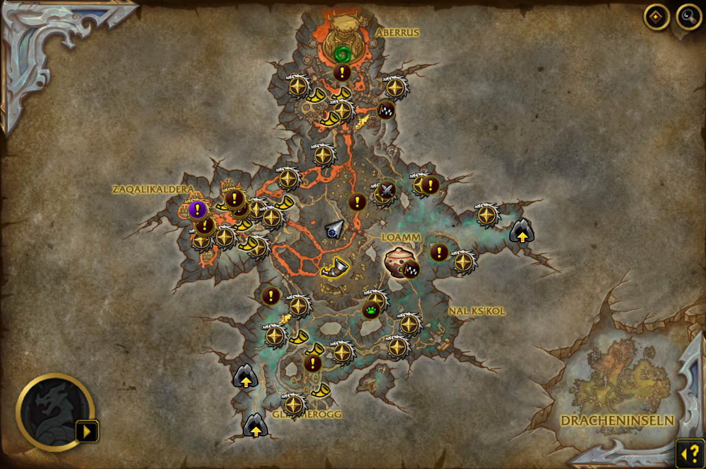
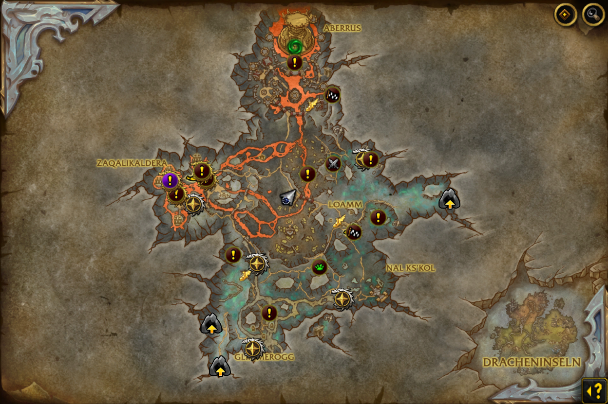

# MapCleaner

Filter annoying WoW world map clutter! You define what is shown there, not Blizzard. Just add area POI, vignette or quest IDs or remove the bounty advertisment via a map ID and to a filter list and enjoy a plain map. Do you want spam

or just what you're interested in and nothing more?

## Usage

It is strongly suggested to use the [idTip](https://github.com/silverwind/idTip/) addon to find IDs to filter **way** more easily.

Use the `/mapcleaner` or `/mc` slash command:
- `/mc filtervignette 1331` removes vignette 1331 from your map.
- `/mc filterpoi 1331` removes area POI 1331 from your map.
- `/mc filterquest 1331` removes quest 1331 from your map.
- `/mc filterbountyboard 1331` removes the bounty board or activity reminder from map 1331. `/mc filterbountyboard current` does the same for the currently opened map.
- `/mc unfiltervignette 1331`, `/mc unfilterpoi 1331`, `/mc unfilterquest 1331` and `/mc unfilterbountyboard 1331` (or `… current`) reverses that.
- `/mc listfiltered` gives you a list with everything you removed.
- `/mc listvisible` gives a many visible POIs, vignettes and quests that can be filtered.
- `/mc listvisibleall` gives a load of POIs, vignettes and quests that can be filtered. The [idTip](https://github.com/silverwind/idTip/) addon is **way** superior to this list since it allows you to hover an annoying icon and just see the ID rather than searching in this way too long list.
